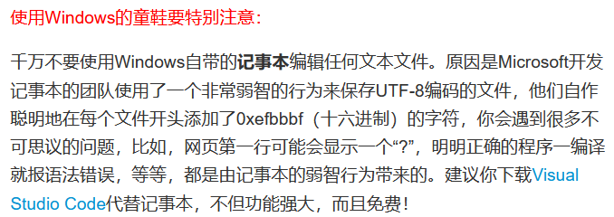

# GitLearn_Note

## 1.Git简介

- Git诞生


利于整理修改思路、协作编辑

- 版本控制系统（集中式VS分布式）
- 安装Git
- 创建版本库（repository）

```bash
$ mkdir learnGit
$ cd learnGit
$ pwd
/c/Users/Administrator/Desktop/code/learnGit
```

- 通过 `git init` 命令将目录变成可管理的仓库

``````bash
$ git init
Initialized empty Git repository in /c/Users/Administrator/Desktop/code/learnGit/.git/
``````

- 若没有看到 `.git` 目录，则是因为该目录默认隐藏，用 `ls` 或 `-ah` 命令即可看见
- 对于.txt文件的提醒



- 将文件放入Git仓库只需2步

① 用 `git add` 将文件添加到仓库

`````` bash
$ git add readme.txt
``````

执行命令无error就是万事大吉，Unix的哲学是“没有消息就是好消息”

② 用 `git commit` 把文件提交到仓库

``````bash
$ git commit -m "wrote a readme file"
[master (root-commit) eaadf4e] wrote a readme file
1 file changed, 2 insertions(+)
create mode 100644 readme.txt
``````

 `git commit` 后接参数 `-m` 可输入任意内容，是本次提交的说明（请务必有意义，便于后续编辑）

 `git add` 可以一次提交很多文件，`git commit` 则可将多个文件一次性放到仓库

- 疑难解答


- ①使用命令 `git add <file>` ，注意可反复多次使用，添加多个文件，②使用命令 `git commit -m <message>` 提交修改，完成。

## 2.时光机穿梭

-  `git status` 可以告诉我们仓库当前状态


-  `git diff` 可以查看修改（对比前后不同）


- ①要随时掌握工作区状态（使用 `git status`命令 ），②如果 `git status` 提示有文件被修改过，则用 `git diff` 可查看修改内容。 
- 查看历史记录可以使用命令 `git log`


注意：`commit 14fb35...` 是 `commit id` （版本号），长数字有效避免了冲突（在协作中更方面）

- 版本回退

①Git中用 `HEAD` 表示当前版本， `HEAD^` 表示上个版本， `HEAD~100` 表示往上100个版本。

② `git reset` 命令可实现版本回退

``````bash
$ git reset --hard HEAD^
HEAD is now at e475afc add ditributed
``````

注意此时使用 `git log` 查看版本库状态时，被回退的版本已不再显示，但是如果没有退出bash窗口，那就可以找到回退版本的id，进而指定回到该版本

``````bash
$ git reset --hard 1094a
HEAD is now at 83b01fe append GPL
``````

版本号可以不写全，Git会自动寻找，但尽量写多一些位，避免找的时候发现结果不唯一。

如果已经退出了bash窗口，也可以通过命令 `git reflog` （会记录我们的每一次命令）找到。

``````bash
$ git reflog
e475afc HEAD@{1}: reset: moving to HEAD^
1094adb (HEAD -> master) HEAD@{2}: commit: append GPL
e475afc HEAD@{3}: commit: add distributed
eaadf4e HEAD@{4}: commit (initial): wrote a readme file
``````

① `HEAD` 指向的版本就是当前版本，因此Git允许我们在版本之间随意穿梭，使用 `git reset --hard commit_id` 即可。

②穿梭前可以使用 `git log` 查看提交历史，以便确定回退到哪个版本。

③要从过去回到未来，用 `git reflog` 查看命令历史，以便确定所有版本信息。

- 工作区和暂存区

 `git add` 命令实际上是把要提交的所有修改放到暂存区（stage)，然后执行 `git commit` 一次性把暂存区的所有修改提交到 `master` 分支。

- 管理修改

Git跟踪并管理的是修改而非文件


- 撤销修改

分为几个阶段：

①如果还没有用 `git add` 提交到暂存区，尚且留在工作区，则可使用 `git checkout -- <file>` 丢弃工作区的修改。

②如果已经添加到暂存区了，但还没有提交到版本库，仍然还有救，可以使用 `git reset HEAD <file>` 将暂存区的修改撤销（unstage），重新放回工作区。（ `git reset` 既可回退版本，也可将修改回退到工作区， `HEAD` 则表示是最新版本）

③如果已经提交到版本库，但是还没有推送到远程，则可使用 `git reset --hard HEAD^` 指令回退上一个版本。

④已经推送到远程了，没救了。

- 删除文件

可以直接用 `rm <file>` 命令删除文件，但此时工作区和版本库中不一致，`git status` 会告诉我们哪些文件被删除。

下面我们有两个选择：

①确实要从版本库中删除该文件，则使用 `git rm <file>` ，并且 `git commit`。

②文件删错了，则将删除的文件恢复到前面提交的最新版本，即使用 `git checkout -- <file>` 命令，用版本库里面的文件替换工作区中的文件。

注意：①命令 `git rm` 用于删除一个文件，如果一个文件已被提交到版本库，则永远不用担心误删除，都可以通过 `git checkout -- <file>` 找回来；不过找回来的文件会损失最近一次提交后修改的内容。②加深对多次`git add`，一次`git commit` 的熟悉，commit之前务必用 `git status` 查看当前状态。

## 3.远程仓库

Git--GitHub，SSH加密传输：

①创建SSH Key


②在GitHub的Settings-SSH Keys中添加 `id_ras.pub` 文件中的内容


- 添加远程库

已经在本地创建一个Git仓库后，可在GitHub上也创建一个Git仓库，并实现远程同步。

①根据GitHub的提示，在本地 `LearnGit` 仓库下运行命令：

``````bash
$ git remote add origin git@github.com:Pyneal/LearnGit.git
``````

注意：`Pyneal` 是我自己的GitHub账户名，需要正确关联才能推送上去（前面设置了SSH Key公钥），` origin` 是Git默认称呼远程库的习惯。

②把本地库的所有内容推送到远程库上：

``````bash
$ git push -u origin master
The authenticity of host 'github.com (20.205.243.166)' can't be established.
ED25519 key fingerprint is SHA256:+DiY3wvvV6TuJJhbpZisF/zLDA0zPMSvHdkr4UvCOqU.
This key is not known by any other names.
Are you sure you want to continue connecting (yes/no/[fingerprint])? y
Please type 'yes', 'no' or the fingerprint: yes
Warning: Permanently added 'github.com' (ED25519) to the list of known hosts.
Enumerating objects: 33, done.
Counting objects: 100% (33/33), done.
Delta compression using up to 8 threads
Compressing objects: 100% (28/28), done.
Writing objects: 100% (33/33), 312.17 KiB | 759.00 KiB/s, done.
Total 33 (delta 6), reused 0 (delta 0), pack-reused 0
remote: Resolving deltas: 100% (6/6), done.
To github.com:Pyneal/LearnGit.git
 * [new branch]      master -> master
branch 'master' set up to track 'origin/master'.
``````

本地库推送到远程，使用 `git push` 命令，实际上是把当前分支 `master` 推送到远程。由于远程库是空的，因此在第一次推送 `master` 分支时加上了 `-u` 参数，Git不但会把本地的 `master` 分支内容推送到远程新的 `master` 分支，还可实现关联，在后续推送或拉取时就可简化命令。

注意：这里提示了一个SSH警告，当我们第一次使用Git的 `clone` 或者 `push` 命令连接GitHub时会出现。这是因为Git使用SSH连接，而SSH在第一次验证GitHub服务器的Key时，需要我们确认GitHub的Key的指纹信息真的来自于GitHub服务器，输入 `yes` 回车即可。

Git会继续提示 `Warning: Permanently added 'github.com' (ED25519) to the list of known hosts`，这个警告只会出现一次。

如果担心有人冒充GitHub服务器，则在输入 `yes` 前可以对照[GitHub的RSA Key指纹信息](https://docs.github.com/en/authentication/keeping-your-account-and-data-secure/githubs-ssh-key-fingerprints)比较是否与SSH连接给出的一致。


③后续本地提交，通过 `git push origin master` 即可实现。

④删除远程库：可以使用 `git remote rm <name>` 命令实现，建议先使用 `git remote -v` 查看远程库信息，然后根据名字删除，比如删除 `origin`: `git remote rm origin` ，还需要注意这里的删除是解除本地和远程的绑定关系，并不是物理上删除了远程库。远程库本身不会有任何改动，要想真正删除远程库，是需要登陆GitHub操作的。

⑤关联远程库：`git remote add name git@server-name/repo-name.git` ；第一次推送master分支： `git push -u origin master` ；后续提交： `git push origin master` ；删除与远程库的关联： `gir remote rm name`

⑥分布式系统最大好处之一便是在本地工作时完全不需要考虑远程库的存在，不联网也可工作，而SVN在没联网时是不能工作的。

- 从远程库克隆

``````bash
$ git clone git@github.com:Pyneal/gitskills.git
Cloning into 'gitskills'...
remote: Enumerating objects: 3, done.
remote: Counting objects: 100% (3/3), done.
remote: Total 3 (delta 0), reused 0 (delta 0), pack-reused 0
Receiving objects: 100% (3/3), done.
``````

`$ git clone git@github.com:Pyneal/gitskills.git` 即可实现，可通过 `cd gitskills`命令进入仓库，使用 `ls` 或 `dir` 命令查看仓库中的文件。

GitHub给出的地址不止一个，还可以用 `https://github.com/Pyneal/gitskills.git` 这样的地址。这是因为Git支持多种协议，默认的 `git://` 使用SSH协议，但也可以使用 `https` 等其他协议。

使用 `https` 协议除了速度慢，有个更大的麻烦是每次推送都必须输入口令。不过某些只开放http端口的公司内部无法使用 `SSH` 而只能使用 `https` 。

## 4.分支管理

- 创建与合并分支

每次提交，Git都会将版本文件串成一条时间线，时间线即是一个分支。如果只有一条时间线，那该分支就叫主分支，即 `master` 分支。 `HEAD` 严格来说不是指向提交，而是指向 `master` ，`master` 才指向提交。


每次提交后，`master` 分支都会前移一步。随着不断提交，`master` 分支线就越来越长。

如果再新建一个分支，比如 `dev` ，Git会新建指针 `dev` ，指向`master` 相同的提交，再把 `HEAD` 指向 `dev` ，表示当前分支在 `dev` 上：


Git创建分支是非常迅速的，因为除了增加一个 `dev` 指针，改变了 `HEAD` 指向，工作区的文件都没有发生任何变化。

但是从现在开始对工作区的修改和提交就是针对 `dev` 分支了。比如新提交一次后，`dev` 指针前移一步， `master` 指针不变：


如果在 `dev` 上完成工作，就可将 `dev` 合并到 `master` 分支上。

- 解决冲突

合并分支往往也不是一帆风顺的。

准备新的 `feature1` 分支，继续新分支开发：

``````bash
$ git switch -c feature1
Switched to a new branch 'feature1'
``````

在 `readme.txt` 上做一些修改，然后在 `feature1` 分支上提交：

``````bash
$ git commit -m "And simple"
[feature1 1dba29d] And simple
 3 files changed, 113 insertions(+), 1 deletion(-)
``````

再切换回到 `master` 分支：

``````bash
$ git switch master
Switched to branch 'master'
Your branch is ahead of 'origin/master' by 6 commits.
  (use "git push" to publish your local commits)
``````

Git还会自动提示我们当前 `master` 分支比远程的 `master` 分支要超前6个提交。

在 `master` 分支上修改 `readme.txt`，然后再提交：

``````bash
$ git add readme.txt 
$ git commit -m "and(&) simple"
[master 3effbff] and(&) simple
 1 file changed, 1 insertion(+), 1 deletion(-)
``````

现在，`master` 分支和 `feture1` 分支各自都有了新的提交，版本流就变成了：


这种情况下，Git无法执行快速合并（`Fast-forward`），只能试图把各自修改合并，但明显会发生冲突：

``````bash
$ git merge feature1
Auto-merging readme.txt
CONFLICT (content): Merge conflict in readme.txt
Automatic merge failed; fix conflicts and then commit the result.
``````

使用 `git status` 也可查看冲突文件：

``````bash
$ git status
On branch master
Your branch is ahead of 'origin/master' by 2 commits.
  (use "git push" to publish your local commits)

You have unmerged paths.
  (fix conflicts and run "git commit")
  (use "git merge --abort" to abort the merge)

Unmerged paths:
  (use "git add <file>..." to mark resolution)

	both modified:   readme.txt

no changes added to commit (use "git add" and/or "git commit -a")
``````

我们也可直接查看 `readme.txt` 中的内容：

``````bash
Git is a distributed version control system.
Git is free software distributed under the GPL.
Git has a mutable index called stage.
Git tracks changes of files.
<<<<<<< HEAD
Creating a new branch is quick & simple.
=======
Creating a new branch is quick AND simple.
>>>>>>> feature1
``````

Git使用 `<<<<<<<`， `=======`， `>>>>>>>`，标记了不同分支内容，我们选择修改后，再提交：

``````bash
$ git add readme.txt 
$ git commit -m "conflict fixed"
[master 03db1fe] conflict fixed
``````

现在，`master` 分支和 `feature1` 分支变成了下图所示：


用带参数的 `git log` 也可查看分支合并情况：

``````bash
$ git log --graph --pretty=oneline --abbrev-commit
*   cf810e4 (HEAD -> master) conflict fixed
|\  
| * 14096d0 (feature1) AND simple
* | 5dc6824 & simple
|/  
* b17d20e branch test
* d46f35e (origin/master) remove test.txt
* b84166e add test.txt
* 519219b git tracks changes
* e43a48b understand how stage works
* 1094adb append GPL
* e475afc add distributed
* eaadf4e wrote a readme file
``````

最后，删除 `feature1` 分支：

``````bash
$ git branch -d feature1
Deleted branch feature1 (was 14096d0).(reference)

$ git branch -d feature1
Deleted branch feature1 (was 1dba29d).
(practical operation)
``````

当Git无法自动合并分支时，必须首先解决冲突。解决冲突后再提交，完成合并。

解决冲突就是把Git合并失败的文件手动编辑为我们希望的内容再提交。

用 `git log --graph` 命令可以看到分支合并图。

- 分支管理策略

通常在合并分支时，如果可能，Git会采用 `Fast forward` 模式，但这种模式下，删除分支后会丢失分支信息。

如果强制禁用 `Fast forward` 模式，Git就会在merge后生成一个新的commit，这样从分支历史上就可看出分支信息。

下面我们可以实战一下 `--no-ff` 方式的 `git merge` 。

首先仍然是创建并切换 `dev` 分支：

``````bash
$ git switch -c dev
Switched to a new branch 'dev'
``````

修改 `readme.txt` 后提交一个新的commit：

``````bash
$ git add readme.txt
$ git commit -m "add merge"
[dev 4726fb2] add merge
  1 file changed, 1 insertion(+)
``````

现在切换回到 `master` :

``````bash
$ git switch master
Switched to branch 'master'
Your branch is up to date with 'origin/master'.
``````

准备合并 `dev` 分支，注意 `--no-ff` 参数，表示禁用 `Fast forward` ：

``````bash
$ git merge --no-ff -m "merge with no-ff" dev
Merge made by the 'recursive' strategy.
 readme.txt | 1 +
 1 file changed, 1 insertion(+)
``````

因为本次合并要创建一个新的commit，因此加上 `-m` 参数，把commit描述写入。

合并后可以用带参数 `git log` 查看分支历史：

``````bash
$ git log --graph --pretty=oneline --abbrev-commit
*   39762af (HEAD -> master) merge with no-ff
|\
| * 4726fb2 (dev) add merge
|/
* aa70fac (origin/master) deal with conflict
*   03db1fe conflict fixed
|\
| * 1dba29d And simple
* | 3effbff and(&) simple
* | 572ccc3 & simple
|/
* b79d850 branch test
......
``````

可以看到，如果不使用 `Fast forward` 模式，merge结果如下图所示：


在实际开发中，我们应该按照几个基本原则进行分支管理：

① `master` 分支应该非常稳定，仅用于发布新版本，平时不能直接在上面干活。

② 干活都在 `dev` 分支上进行，这些分支是不稳定的，可以协作修改，版本发布时才将 `dev` 分支合并到 `master` 分支上，在 `master` 分支发布新版本。

③每个协作者都有自己的子分支，可以时不时往 `dev` 分支上合并。

团队合作示意图：


Git分支很强大，在团队开发中应用广泛。合并分支时加上 `--no-ff` 参数就可用普通模式合并，合并后历史有分支，能看出曾经做过合并，而 `fast forward` 合并就看不出合并了。
