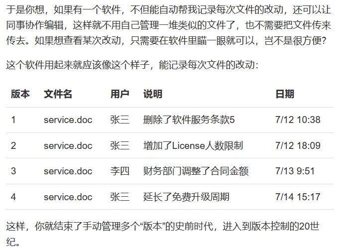

# GitLearn_Note

## 1.Git简介

- Git诞生



利于整理修改思路、协作编辑

- 版本控制系统（集中式VS分布式）
- 安装Git
- 创建版本库（repository）

```bash
$ mkdir learnGit
$ cd learnGit
$ pwd
/c/Users/Administrator/Desktop/code/learnGit
```

- 通过 `git init` 命令将目录变成可管理的仓库

``````bash
$ git init
Initialized empty Git repository in /c/Users/Administrator/Desktop/code/learnGit/.git/
``````

- 若没有看到 `.git` 目录，则是因为该目录默认隐藏，用 `ls` 或 `-ah` 命令即可看见
- 对于.txt文件的提醒


- 将文件放入Git仓库只需2步

① 用 `git add` 将文件添加到仓库

`````` bash
$ git add readme.txt
``````

执行命令无error就是万事大吉，Unix的哲学是“没有消息就是好消息”

② 用 `git commit` 把文件提交到仓库

``````bash
$ git commit -m "wrote a readme file"
[master (root-commit) eaadf4e] wrote a readme file
1 file changed, 2 insertions(+)
create mode 100644 readme.txt
``````

 `git commit` 后接参数 `-m` 可输入任意内容，是本次提交的说明（请务必有意义，便于后续编辑）

 `git add` 可以一次提交很多文件，`git commit` 则可将多个文件一次性放到仓库

- 疑难解答


- ①使用命令 `git add <file>` ，注意可反复多次使用，添加多个文件，②使用命令 `git commit -m <message>` 提交修改，完成。

## 2.时光机穿梭

-  `git status` 可以告诉我们仓库当前状态


-  `git diff` 可以查看修改（对比前后不同）


- ①要随时掌握工作区状态（使用 `git status`命令 ），②如果 `git status` 提示有文件被修改过，则用 `git diff` 可查看修改内容。 
- 查看历史记录可以使用命令 `git log`


注意：`commit 14fb35...` 是 `commit id` （版本号），长数字有效避免了冲突（在协作中更方面）

- 版本回退

①Git中用 `HEAD` 表示当前版本， `HEAD^` 表示上个版本， `HEAD~100` 表示往上100个版本。

② `git reset` 命令可实现版本回退

``````bash
$ git reset --hard HEAD^
HEAD is now at e475afc add ditributed
``````

注意此时使用 `git log` 查看版本库状态时，被回退的版本已不再显示，但是如果没有退出bash窗口，那就可以找到回退版本的id，进而指定回到该版本

``````bash
$ git reset --hard 1094a
HEAD is now at 83b01fe append GPL
``````

版本号可以不写全，Git会自动寻找，但尽量写多一些位，避免找的时候发现结果不唯一。

如果已经退出了bash窗口，也可以通过命令 `git reflog` （会记录我们的每一次命令）找到。

``````bash
$ git reflog
e475afc HEAD@{1}: reset: moving to HEAD^
1094adb (HEAD -> master) HEAD@{2}: commit: append GPL
e475afc HEAD@{3}: commit: add distributed
eaadf4e HEAD@{4}: commit (initial): wrote a readme file
``````

① `HEAD` 指向的版本就是当前版本，因此Git允许我们在版本之间随意穿梭，使用 `git reset --hard commit_id` 即可。

②穿梭前可以使用 `git log` 查看提交历史，以便确定回退到哪个版本。

③要从过去回到未来，用 `git reflog` 查看命令历史，以便确定所有版本信息。

- 工作区和暂存区

 `git add` 命令实际上是把要提交的所有修改放到暂存区（stage)，然后执行 `git commit` 一次性把暂存区的所有修改提交到 `master` 分支。

- 管理修改

Git跟踪并管理的是修改而非文件


- 撤销修改

分为几个阶段：

①如果还没有用 `git add` 提交到暂存区，尚且留在工作区，则可使用 `git checkout -- <file>` 丢弃工作区的修改。

②如果已经添加到暂存区了，但还没有提交到版本库，仍然还有救，可以使用 `git reset HEAD <file>` 将暂存区的修改撤销（unstage），重新放回工作区。（ `git reset` 既可回退版本，也可将修改回退到工作区， `HEAD` 则表示是最新版本）

③如果已经提交到版本库，但是还没有推送到远程，则可使用 `git reset --hard HEAD^` 指令回退上一个版本。

④已经推送到远程了，没救了。

